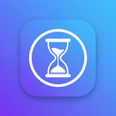

# Regain — Focus & Digital Wellbeing (PC)

A full **Regain for PC**: strict app blocking, Pomodoro timers, multiplayer study
rooms, screen‑time tracking, and Reels/Shorts blocking that still lets educational
content through. Built as a Tauri 2 desktop app (Rust core + React UI) with a
browser‑preview mode so the whole product runs without a desktop build.



---

## What's inside

| Area | What you get |
| --- | --- |
| **Focus Timer** | Study (open‑ended), Stopwatch with laps, Countdown with presets 5–180 min, subject tagging, per‑session 👍/👎 |
| **Pomodoro** | Adjustable focus/short/long lengths, rounds before a long break, auto‑start breaks and focus, live phase ring |
| **App Blocker** | 20+ preloaded Windows processes (Instagram, TikTok, Snapchat, X, Reddit, Discord, Steam, Free Fire…), custom additions, "in focus" vs "always" per rule |
| **Website Blocker** | 20+ domains incl. adult sites, subdomain matching, bulk "block all" by category, custom domains |
| **Block Reels & Shorts** | Hides Instagram Reels, YouTube Shorts, Snapchat Spotlight and Facebook Reels; `/shorts/` URLs are intercepted and media paused |
| **YouTube Study Mode** | Channel allow‑list; home feed, recommendations, comments and trending are removed while you focus |
| **Screen Time Tracker** | Per‑app and per‑site usage, category donut, 14‑day focus chart, blocked‑attempt log, session history with ratings |
| **Multiplayer Rooms** | Real WebSocket study rooms with shared leaderboard, chat, reactions and a zero‑dependency relay server |
| **Focus Planner** | Weekly grid, drag‑free block editor, completion ticks, "start this block" one‑click |
| **Focus Music** | 10 soundscapes synthesised live with the Web Audio API (rain, brown/pink/white noise, ocean, fire, forest, café, lo‑fi pads, 40 Hz deep focus) — no audio files shipped |
| **Themes** | 7 themes incl. AMOLED and Daylight, 8 accents, 5 wallpapers |
| **Strict Mode** | Levels 1–3 (confirm → hold‑to‑quit → cannot stop), anti‑uninstall guard, strict record tracking |
| **Progress** | Streaks, 10‑week consistency heatmap, subject balance, trend vs previous week, rating‑driven session suggestions |
| **Pro** | Free vs Pro feature matrix, plan picker, demo activation |

---

## Quick start

### 1. Browser preview (no desktop build needed)

```bash
npm install
npm run relay     # terminal 1 — multiplayer relay on :8790 (optional)
npm run dev       # terminal 2 — Vite dev server on 0.0.0.0:1420
```

Open `http://localhost:1420`. Everything works here: the foreground‑window
monitor is *simulated* (rotating fake windows + interception events), audio is
real, rooms connect to the real relay.

### 2. Desktop app (Tauri 2)

Requires Rust + the platform webview prerequisites
(<https://tauri.app/start/prerequisites/>).

```bash
npm install
npm run tauri dev      # hot‑reloading desktop app
npm run tauri build    # installers in src-tauri/target/release/bundle
```

The Rust crate lives at the repo root (`lib.rs`, `monitor.rs`, `Cargo.toml`,
`build.rs`) with config in `tauri.conf.json` and permissions in
`capabilities/default.json`.

**Privacy:** the core reads only the foreground **process name** and **window
title** (`GetForegroundWindow` / `osascript` / `xdotool`) and never screen
content. Website attribution comes from the extension reporting the active tab
domain.

### 3. Companion extension (Chrome / Edge, MV3)

1. Open `chrome://extensions` → enable **Developer mode**.
2. **Load unpacked** → select the `regain-extension/` folder.
3. Start a focus session in Regain. The badge turns **ON** and blocking arms
   automatically; when the app is closed the last known state is kept.

### 4. Tests

```bash
npm test              # all four suites
npm run test:engine   # pure logic (analytics, streaks, ratings, rooms)
npm run test:relay    # raw RFC 6455 protocol test of the relay
```

`npm test` bundles the app with esbuild, starts a relay if one is not running,
then runs **78 checks**: engine logic, relay protocol, UI render of all 12
routes, and a full flow test where the jsdom app and a second WebSocket client
join the same room through the real relay.

---

## Architecture

```
┌──────────────────────────── React UI (src/) ────────────────────────────┐
│ pages/    12 feature screens            store/AppStore.tsx  single source│
│ components/ Shell, FocusGuard, UI kit   lib/  timer, blocker, audio,     │
│ styles/    design system tokens         rooms, analytics, recommendations│
└───────────────┬──────────────────────────────────────┬──────────────────┘
                │ invoke / events                      │ WebSocket
      ┌─────────▼──────────┐              ┌────────────▼───────────────────┐
      │ Rust core (Tauri)  │              │ room relay (server/*.mjs)      │
      │ • focus state      │              │ • rooms, presence, chat        │
      │ • window monitor   │              │ • focused minutes only         │
      │ • blocker + overlay│              └────────────────────────────────┘
      └─────────┬──────────┘
                │ ws://127.0.0.1:48123
      ┌─────────▼───────────────────────────────────────────────────────┐
      │ Browser extension (regain-extension/)                           │
      │ • declarativeNetRequest domain redirects → blocked.html         │
      │ • CSS shields for Reels/Shorts, Study Mode channel allow‑list   │
      │ • reports the active tab domain back to the core                │
      └─────────────────────────────────────────────────────────────────┘
```

### Timer engine

`store/AppStore.tsx` owns a 1 Hz tick that (a) accrues screen‑time for the live
window, (b) advances rooms, and (c) completes sessions when the planned time is
reached. Pomodoro rounds are logged individually and phase‑advance through
short/long breaks. State is persisted to `localStorage` under
`regain.pc.state.v1` (debounced, trimmed to 400 sessions / 60 days of usage).

### Bridge protocol (`:48123`)

| Direction | Frame |
| --- | --- |
| app → extension | `{type:"FOCUS_MODE_STATE", active, strict, domains, reelsBlocked, studyMode, channels}` |
| app → extension | `{type:"TIMER", mode, remainingSec, plannedSec, label}` |
| extension → app | `{type:"ACTIVE_DOMAIN", domain, url, title}` |

### Room relay protocol (`:8790`)

Client sends `hello` / `progress` / `chat` / `reaction` / `bye`; the server
broadcasts `{t:"state", members, chat}`. Health check: `GET /health`.
Override with `PORT` / `HOST`. Members expire after 45 s of silence and empty
rooms are reaped.

---

## Configuration highlights

| Setting | Where | Default |
| --- | --- | --- |
| Daily focus goal | Settings → Profile | 120 min |
| Strict level | Strict Mode | 2 (hold to quit) |
| Focus Guard overlay | Settings → Focus behaviour | off |
| Block during focus | Settings → Focus behaviour | on |
| Soundscape + volume | Focus Music | Rainfall, 35% |
| Room relay URL | Settings → System | auto (`:8790` on this host) |

---

## Verification status

Verified in this workspace:

* `npm run build` — TypeScript clean, 55 modules, 289 kB JS (88 kB gzip).
* `npm test` — engine 28, relay 11, ui‑render 17, ui‑flow 22 checks pass.
* Relay verified end‑to‑end with two independent clients (presence, progress,
  chat, reactions, leave).
* Live Vite preview serves every route; the dev server binds `0.0.0.0` and
  allows tunnel hosts.

Not verified here (no Rust toolchain and no Windows in this environment):

* `cargo build` / `npm run tauri build` — the Rust core and `tauri.conf.json`
  are written against Tauri 2 APIs but have not been compiled.
* Native foreground‑window detection and minimise‑on‑sight blocking.
* The unpacked Chrome extension inside a real browser.

---

## Project layout

```
lib.rs, monitor.rs, Cargo.toml, build.rs   Rust core (focus engine, window monitor, bridge)
tauri.conf.json, capabilities/             Tauri config + permissions
icons/                                     app icons (generated)
index.html, vite.config.ts, tsconfig.json  frontend build
src/
  App.tsx, main.tsx                        shell, routing, blocker window
  components/                              Shell, FocusGuard, UI kit
  pages/                                   12 feature screens
  store/AppStore.tsx                       state, timer engine, blocker, rooms
  lib/                                     types, defaults, utils, audio, rooms,
                                           desktop bridge, demo data, recommendations
  styles/global.css                        design system
regain-extension/                          Chrome/Edge MV3 companion
server/room-server.mjs                     zero-dependency WebSocket relay
tests/                                     engine, relay, ui-render, ui-flow suites
```

## License

Provided as-is for the Regain project.
